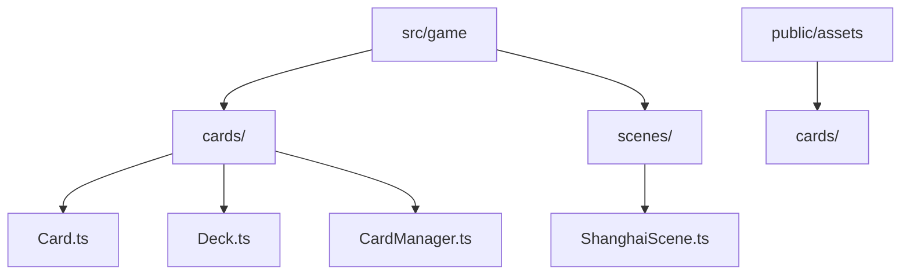
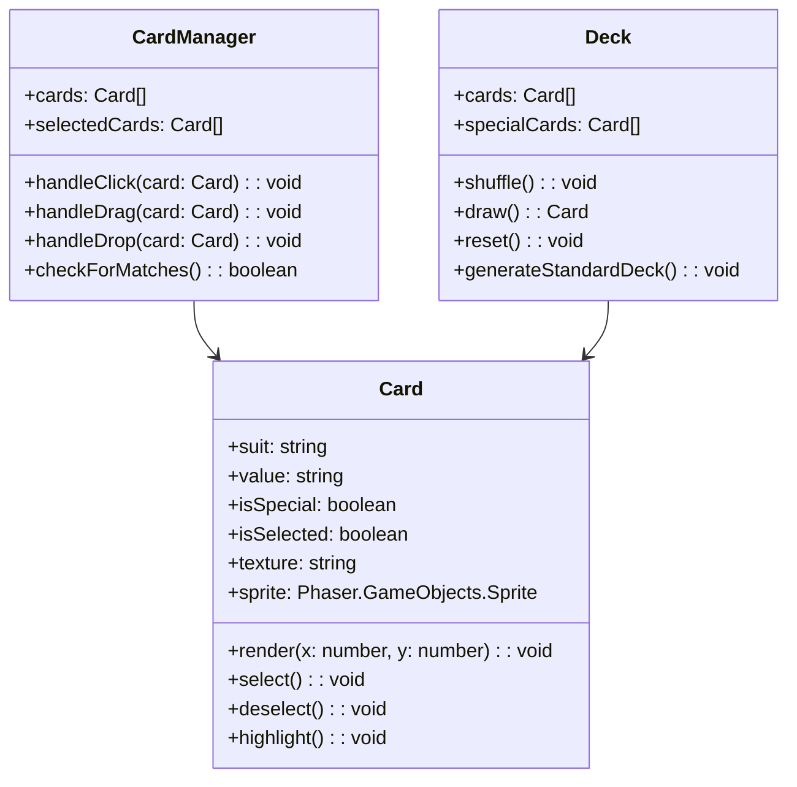
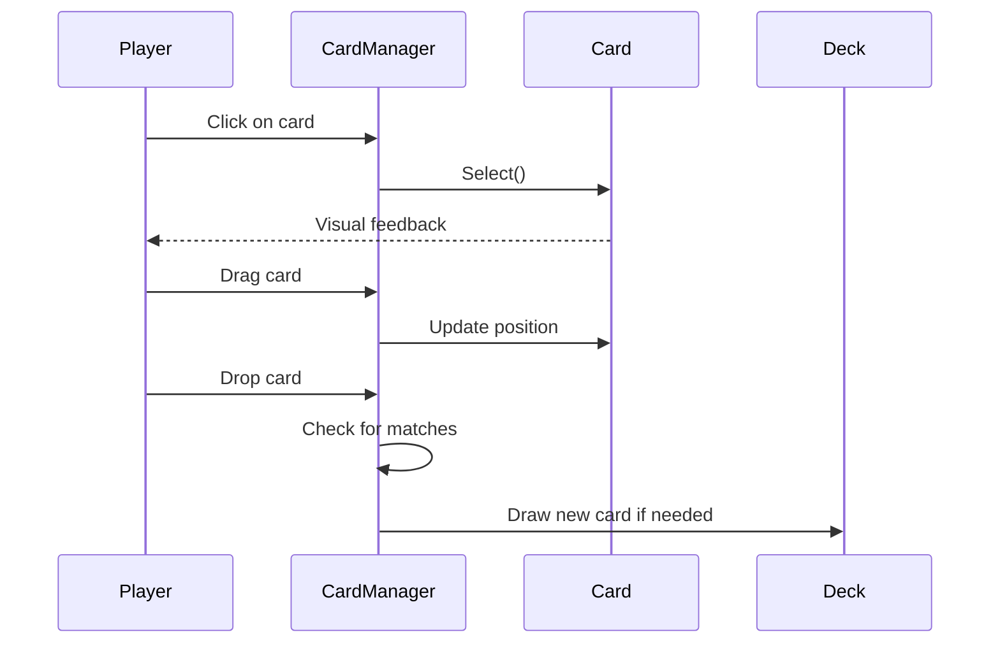
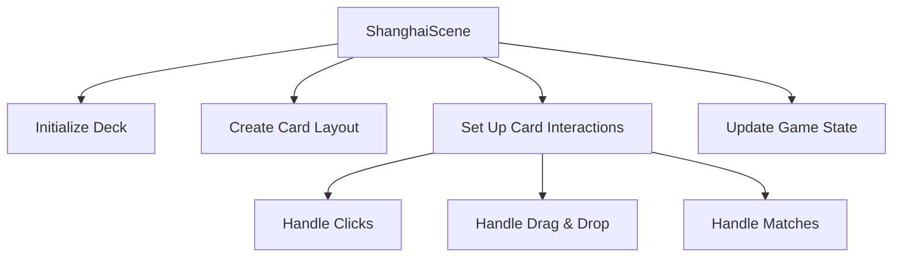

# Shanghai Draw Implementation Plan

## File Structure

## Class Diagram

## Sequence Diagram (Card Interactions)

## Scene Structure

## Implementation Steps
1. Create card/ directory with Card.ts, Deck.ts, and CardManager.ts
2. Create ShanghaiScene.ts
3. Add cards/ directory to public/assets for SVG files
4. Implement basic card rendering
5. Add card interaction logic
6. Integrate with existing scene structure